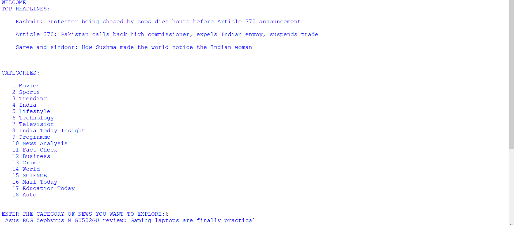

# Project Description 
<h2 align="center">( Internship Project created in year 2019 )</h2>

<h1 align="center">News Reading </h1>
 <h2 align="center">College Internship Project based on Text To Speech ( TTS ) using Machine Learning with Python</h2>

<h2 align="center">INTRODUCTION  TO  PROJECT </h2>
 This program generally fetches the news from a news websites and going to read for the reader. It asks for the category for reading up the news. News heading as well as its content will be read by two different persons i.e. male and female.

 The News is collected by web crawling method which is powerful tool in python language. And the reading of the news is done using audio package pyttx3.

 This project includes web crawling and text to speech. This program fetches the news
from news websites and read the news for the user. It asks for the category of the news
which the user wants. News heading and its content will be read by two different voices
i.e. male and female .

 Web crawling can be stated as - A Web crawler is an Internet bot which helps in Web
indexing. They crawl one page at a time through a website until all pages have been
indexed. Web crawlers help in collecting information about a website and the links
related to them, and also help in validating the HTML code and hyperlinks.

 Text to speech, abbreviated as TTS, is a form of speech synthesis that converts text into
spoken voice output. Text to speech systems were first developed to aid the visually
impaired by offering a computer-generated spoken voice that would &quot;read&quot; text to the
user.

 Hence , all the mechanisms mentioned above are used in this project.

<h2 align="center">FILES  IMPORTED </h2>
 i)	bs4 :

 Beautiful Soup is a Python package for parsing HTML and XML documents (including having malformed markup, i.e. non-closed tags, so named after tag soup). It creates a parse tree for parsed pages that can be used to extract data from HTML, which is useful for web scraping. 

 It is available for Python 2.7, Python 3 and Python 3+.

 ii)	urllib.request :

The urllib.request module defines functions and classes which help in opening URLs (mostly HTTP) in a complex world — basic and digest authentication, redirections, cookies and more.

 The urllib.request module defines the following functions:
urllib.request.urlopen(url, data=None, [timeout, ]*, cafile=None, capath=None, cadefault=False, context=None) Open the URL url, which can be either a string or a Request object.

 Data must be an object specifying additional data to be sent to the server, or None if no such data is needed. urllib.request module uses HTTP/1.1 and includes Connection: close header in its HTTP requests.

 The optional timeout parameter specifies a timeout in seconds for blocking operations like the connection attempt (if not specified, the global default timeout setting will be used). This actually only works for HTTP, HTTPS and FTP connections.

 If context is specified, it must be a ssl.SSLContext instance describing the various SSL options. See HTTPSConnection for more details.

 The optional cafile and capath parameters specify a set of trusted CA certificates for HTTPS requests. cafileshould point to a single file containing a bundle of CA certificates, whereas capath should point to a directory of hashed certificate files. 

 iii)	pyttsx3 :

 This lets you to convert written text to audio. The voices available will depend on what your system has installed. You can get a list of available voices on your machine by pulling the voices property from the engine. Note that the voices you have available on your computer might be different from someone else's machine. There is a default voice set so you are not required to pick a voice. This is only if you want to change it from the default.

<h3 align="center">------ Mechanisms used ------ </h3>
 <h2 align="center">i) WEB CRAWLING </h2>
 Web scraping, often called web crawling or web spidering, or “programmatically going over a collection of web pages and extracting data,” is a powerful tool for working with data on the web.

 With a web scraper, you can mine data about a set of products, get a large corpus of text or quantitative data to play around with, get data from a site without an official API, or just satisfy your own personal curiosity.

 <h2 align="center">ii) TEXT TO SPEECH (TTS) </h2>
 Text-to-speech (TTS) is a type of assistive technology that reads digital text aloud. It’s sometimes called “read aloud” technology.

 TTS can help people who struggle with reading.

 There are TTS tools available for nearly every digital device.

<h2 align="center">PROJECT OUTPUT </h2>
 
